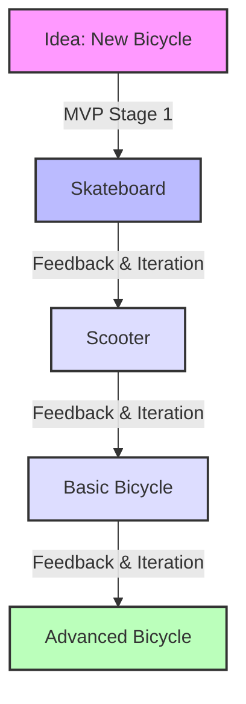

# Understanding Minimum Viable Product (MVP)

Hello, students! Today, we're going to learn about a very important concept in product development called the Minimum Viable Product, or MVP for short. Let's break it down step by step.

## What is an MVP?

An MVP is the simplest version of a product that can still provide value to customers. It's like making a rough draft of your idea that works just well enough to see if people like it.

### Key Points:
1. **Minimum**: It has only the core features.
2. **Viable**: It actually works and solves a problem.
3. **Product**: It's something you can give to customers.

## Why is MVP important?

1. **Saves time and money**: You don't waste resources building things people might not want.
2. **Gets feedback quickly**: You can learn from real users early on.
3. **Allows for improvements**: You can make your product better based on what you learn.

## Real-Life Example: Building a Bicycle

Let's imagine we want to create a new type of bicycle. Here's how we might approach it using the MVP concept:

### Explanation of the MVP Process:

1. **Skateboard (MVP Stage 1)**:
   - This is our first MVP. It's not a bicycle, but it helps people move faster than walking.
   - We can quickly see if people like the idea of a personal transportation device.

2. **Scooter**:
   - Based on feedback, we add handlebars for better control.
   - Still simple, but closer to our final goal.

3. **Basic Bicycle**:
   - Now we have the core function of a bicycle: two wheels, pedals, and a seat.
   - It's not fancy, but it works and gives the main benefits of cycling.

4. **Advanced Bicycle**:
   - After more feedback and iterations, we can add advanced features like gears, better brakes, or a more comfortable seat.

## Conclusion

Remember, the MVP approach is all about starting simple, learning quickly, and improving steadily. It's okay if your first version isn't perfect – that's the whole point! By starting with a basic version and improving it based on real feedback, you're more likely to create something people truly want and need.

Any questions about MVPs or our bicycle example?
