# Introduction to Zabbix: Your Digital Doctor for Computers

## What is Zabbix?

Imagine you have a digital pet. This pet could be a computer, a smartphone, or even a smart refrigerator. Just like how you need to take care of a real pet, these digital pets need care too. But how do you know when your digital pet is sick or needs attention? That's where Zabbix comes in!

Zabbix is like a super smart doctor for your digital pets. It keeps an eye on them 24/7 and lets you know if anything is wrong.

## How Does Zabbix Work?

Let's break it down with a fun diagram:

```mermaid
graph TD
    A[Your Digital Pets] -->|Send health info| B(Zabbix)
    B -->|Checks health| C{Is everything OK?}
    C -->|Yes| D[Happy Face 😊]
    C -->|No| E[Alert! 🚨]
    E -->|Sends message| F[You]
    F -->|Fix the problem| A
```

1. Your digital pets (like computers or servers) constantly send information about their health to Zabbix.
2. Zabbix checks this information to see if everything is okay.
3. If everything is fine, Zabbix shows a happy face.
4. If something is wrong, Zabbix sends an alert to you.
5. You can then fix the problem, making your digital pet happy again!

## Real-Life Examples

### Example 1: The Overheating Laptop

Imagine you're studying for a big exam, and your laptop is your trusty sidekick. But what if it starts getting too hot?

Without Zabbix:
- Your laptop might slow down or crash
- You might lose your work
- You could damage your laptop

With Zabbix:
- Zabbix notices the temperature rising
- It sends you a message: "Hey! Your laptop is getting too hot!"
- You can take a break, let it cool down, or check if something's blocking the fan
- Your laptop stays healthy, and you can keep studying!

### Example 2: The Hungry Server

Let's say you run a popular blog about cute cat pictures. Your blog lives on a server, which is like a super powerful computer.

Without Zabbix:
- Your server might run out of space for new pictures
- Your blog could crash when you upload that adorable kitten photo
- Your readers would be sad without their daily dose of cuteness

With Zabbix:
- Zabbix keeps an eye on how much space is left on your server
- When it's getting low, Zabbix sends an alert: "Server is getting full! Time to make more room!"
- You can remove old files or upgrade your server
- Your blog stays up, and the cat pictures keep flowing!

## Why is Zabbix Important?

1. **Prevents Problems**: Just like how regular check-ups help you stay healthy, Zabbix helps your digital systems stay in top shape.

2. **Saves Time**: Instead of manually checking everything, Zabbix does it for you automatically.

3. **Learns Patterns**: Zabbix can learn what's normal for your systems and alert you only when something unusual happens.

4. **Helps Plan Ahead**: By watching how your systems grow and change over time, Zabbix can help you plan for the future.

## Conclusion

Zabbix might sound complicated, but it's really just a helpful tool that keeps your digital world running smoothly. It's like having a super smart, always-alert assistant who never sleeps and always lets you know if something needs your attention.

Remember: In today's digital age, tools like Zabbix are becoming more and more important. Whether you're managing a personal blog or dreaming of running a big tech company one day, understanding how to keep digital systems healthy is a valuable skill!
